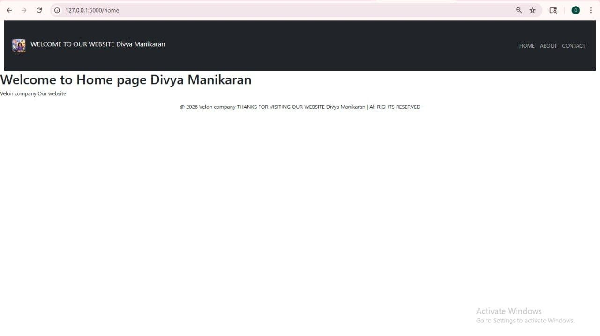

# Basic Flask App

## Project Title
Flask Multi-Page Web Application using Jinja2 Templates

## Description
Built a multi-page web application using Python and Flask, implementing template inheritance with Jinja2 to create reusable layouts. Developed dynamic routing and integrated backend data into HTML templates, along with handling static assets like images.

## Key Features
- Implemented multiple routes (Home, About, Contact)
- Used Jinja2 template inheritance for reusable UI structure
- Dynamically rendered data using {{ }} expressions
- Managed navigation using url_for() for dynamic URL handling
- Handled static files (images) using Flask static folder

## Technologies Used
- Python
- Flask
- HTML
- Bootstrap (basic)
- Jinja2

## How to Run
1. Clone the repository  
2. Navigate to project folder  
3. Install Flask:
   pip install flask  
4. Run:
   python app.py  
5. Open:
   http://127.0.0.1:5000/

## Output

